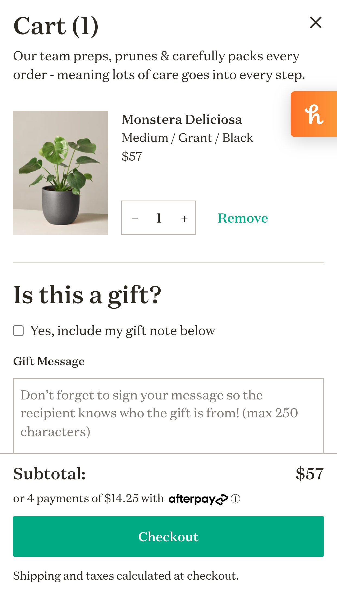

# Procesverslag
Markdown is een simpele manier om HTML te schrijven.  
Markdown cheat cheet: [Hulp bij het schrijven van Markdown](https://github.com/adam-p/markdown-here/wiki/Markdown-Cheatsheet).

Nb. De standaardstructuur en de spartaanse opmaak van de README.md zijn helemaal prima. Het gaat om de inhoud van je procesverslag. Besteedt de tijd voor pracht en praal aan je website.

Nb. Door *open* toe te voegen aan een *details* element kun je deze standaard open zetten. Fijn om dat steeds voor de relevante stuk(ken) te doen.

## Jij

uitwerken voor kick-off werkgroep

### Auteur:
Jaclyn Karsseboom

#### Je startniveau:
Blauwe piste

#### Je focus:
Responsive?
 

## Je website

uitwerken voor kick-off werkgroep

### Je opdracht:
https://www.thesill.com/

#### Screenshot(s) van de eerste pagina (small screen): 
Homepagina 

#### Screenshot(s) van de tweede pagina (small screen):
Productpagina

 

## Breakdownschets (week 1)

uitwerken na afloop 2e werkgroep

### de hele homepagina: 

### de hele productpagina: 

### dynamisch deel (bijv menu): 

### wellicht nog een dynamisch deel (bijv filter): 

## Voortgang 1 (week 2)

uitwerken voor 1e voortgang

### Stand van zaken
hier dit ging goed & dit was lastig (neem ook screenshots op van delen van je website en code)

-dit ging goed- Mijn HTML tot nu toe is netjes en goed leesbaar. Ik heb verschillende elementen in mijn code staan, zoals lists, input forms en select forms. Ik heb de bronnen van hoe ik deze correct moest coderen opgeslagen in de bronnenlijst.

-dit was lastig- Ik vind het spannend om mijn werk te laten zien aan anderen en ik ben bang dat ik niet ver genoeg ben gekomen. Ik heb wat moeite met op gang komen als het gaat om waar ik moet beginnen met CSS.

### voortgang 1 homepagina: 

### voortgang 1 productpagina: 

### Agenda voor meeting
samen met je groepje opstellen

| student 1      | student 2          | student 3    | student 4        |
| ---            | ---                | ---          | ---              |
| dit bespreken  | en dit             | en ik dit    | en dan ik dat    |
| en dat ook nog | dit als er tijd is | nog een punt | dit wil ik zeker |
| ...            | ...                | ...          | ...              |

### Verslag van meeting
hier na afloop snel de uitkomsten van de meeting vastleggen

- Een paragraph in een anchor is dubbelop.
- De call to action knop moet een link zijn, geen button. Buttons zijn meer voor een form submitten en links leiden naar een andere pagina.
- Hamburger menu uit laten klappen is complex, google hamburger menu en ga de voorbeelden namaken.
- Zet de producten en het about gedeelte in UL's i.p.v. articles: dan wordt er al een beetje styling voor jou gedaan.
- List in flexbox aanpassen naar de gewenste layout: CSS tricks website bekijken.
- Afbeeldingen zet je naast elkaar in grid.
- Voor nu is het gebruik van classes oke, maar voor het eindgesprek moet je zoveel mogelijk CSS selectors hebben.

## Voortgang 2 (week 3)

uitwerken voor 2e voortgang

### Stand van zaken
hier dit ging goed & dit was lastig (neem ook screenshots op van delen van je website en code)

-dit ging goed- Mijn HTML heb ik wat netter gemaakt en ik heb alle afbeeldingen toegevoegd. Grid is gelukt in het productenoverzicht op de homepage. Bronnen bewaard in de bronvermelding.

-dit was lastig- Ik vond het lastig om te beginnen met CSS. Mijn tweede pagina is nu door de war doordat ik de CSS heb gemaakt met de hoofdpagina in gedachte: ik weet niet hoe dat moet (moet ik dan met classes werken?). Daarnaast lukt het niet om de buttons kan stylen. Lastig om het hamburger menu te maken en het menu met flexbox naast elkaar te zetten.

### voortgang 2 homepagina: 

### voortgang 2 productpagina: 

### Agenda voor meeting
samen met je groepje opstellen

| student 1      | student 2          | student 3    | student 4        |
| ---            | ---                | ---          | ---              |
| dit bespreken  | en dit             | en ik dit    | en dan ik dat    |
| en dat ook nog | dit als er tijd is | nog een punt | dit wil ik zeker |
| ...            | ...                | ...          | ...              |

### Verslag van meeting
hier na afloop snel de uitkomsten van de meeting vastleggen

- punt 1
- punt 2
- nog een punt
- ...

## Toegankelijkheidstest (week 4)

uitwerken na test in 8e voortgang

### Bevindingen
Lijst met je bevindingen die in de test naar voren kwamen:

#### Titel eerste bevinding
Hier korte omschrijving (met indien nodig een afbeelding)

Hier een omschrijving van hoe het opgelost kan worden (met indien nodig een afbeelding)

#### Titel tweede bevinding. 
Hier korte omschrijving (met indien nodig een afbeelding)

Hier een omschrijving van hoe het opgelost kan worden (met indien nodig een afbeelding)

#### Titel volgende bevinding. 
Hier korte omschrijving (met indien nodig een afbeelding)

Hier een omschrijving van hoe het opgelost kan worden (met indien nodig een afbeelding)

#### Titel nog een bevinding. 
Hier korte omschrijving (met indien nodig een afbeelding)

Hier een omschrijving van hoe het opgelost kan worden (met indien nodig een afbeelding)

## Voortgang 3 (week 4)

uitwerken voor 3e voortgang

### Stand van zaken
hier dit ging goed & dit was lastig (neem ook screenshots op van delen van je website en code)

### Agenda voor meeting
samen met je groepje opstellen

| student 1      | student 2          | student 3    | student 4        |
| ---            | ---                | ---          | ---              |
| dit bespreken  | en dit             | en ik dit    | en dan ik dat    |
| en dat ook nog | dit als er tijd is | nog een punt | dit wil ik zeker |
| ...            | ...                | ...          | ...              |

### Verslag van meeting
hier na afloop snel de uitkomsten van de meeting vastleggen

- punt 1
- punt 2
- nog een punt
- ...

## Eindgesprek (week 5)

uitwerken voor eindgesprek

### Stand van zaken
hier dit ging goed & dit was lastig (neem ook screenshots op van delen van je website en code)

### Screenshot(s)

hier screenshot(s) van je eindresultaat

## Bronnenlijst

continu bijhouden terwijl je werkt

Nb. Wees specifiek ('css-tricks' als bron is bijv. niet specifiek genoeg).

1. bron 1 - comments in html: https://html.com/tags/comment-tag/
2. bron 2 - image tag: https://developer.mozilla.org/en-US/docs/Learn/HTML/Multimedia_and_embedding/Images_in_HTML
3. bron 3 - links, inputs en buttons: https://www.youtube.com/watch?v=bFvjE4ZRtSE&list=PLZlA0Gpn_vH9xx-RRVNG187ETT2ekWFsq&index=9
4. bron 4 - input type select: https://www.w3schools.com/tags/att_select_form.asp
5. bron 5 - radio buttons: https://www.w3schools.com/html/html_forms.asp 
6. bron 6 - font: https://fonts.adobe.com/fonts/tenez?mv=affiliate&mv2=red
7. bron 7 - video in html: https://developer.mozilla.org/en-US/docs/Web/HTML/Element/video en https://www.w3schools.com/html/html_youtube.asp 
8. bron 8 - button voor screen readers: https://codepen.io/jaclynck-the-typescripter/pen/VwMwVqX 
9. bron 9 - forms stylen: https://www.w3schools.com/css/css_form.asp
10. bron 10 - styling input buttons: https://www.w3schools.com/css/css_form.asp 

bron  - uitklapbare hamburger menu https://codepen.io/jaclynck-the-typescripter/pen/VwMwVqX  

